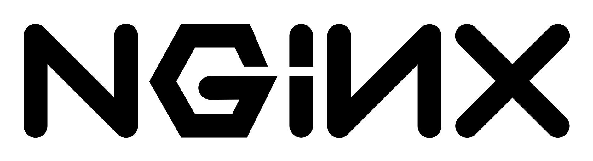
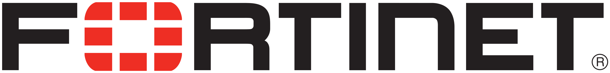
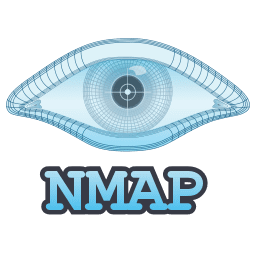
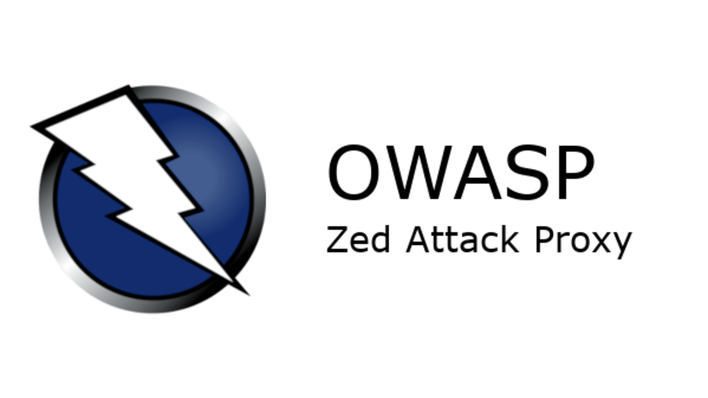

# Hi there 👋 I'm Divya

🎓 I'm a final-year Computer Engineering student at **Télécom Nancy**, specialising in **Internet Systems & Security**.  
💡 I also hold a **BSc in Computer Science (Systems Engineering)** from a **British university**.  
🌍 My academic path has taken me across **France**, **the US**, **the UK**, and **Mauritius**, shaping a strong international outlook and adaptability.

🔐 I’m passionate about **cybersecurity**, **AI**, and **software development**, with hands-on experience in:  
- SIEM integration (Microsoft Sentinel, Fortinet logs)  
- Deep learning & object detection (YOLO, Faster-RCNN, Optuna)  
- Secure network orchestration using **Docker** and **TLS**  

📚 I’m currently looking for a **6-month final-year internship** starting **March 2026**, in **cybersecurity**, **Cloud Computing** or **DevSecOps**.

---
## 🛠️ Tech Stack

<h4 align="center">Programming Languages</h4>

  <!-- Programming Languages -->
  
  
  
  
  
  

<h4 align="center">Frameworks & Tools</h4>

  <!-- Frameworks & Tools -->
  
  
  
  
  

<h4 align="center">Security & Cloud</h4>

  <!-- Security & Cloud -->
  
  
  
  

---
## 🌐 Connect with me

📧 [Mail](mailto:divya.pugo@gmail.com)  🔗 [LinkedIn](https://www.linkedin.com/in/divya-pugo-985691194/)  💻 [GitHub](https://github.com/divpugo)

---

✨ _“Learn constantly, secure boldly, and build with purpose.”_
